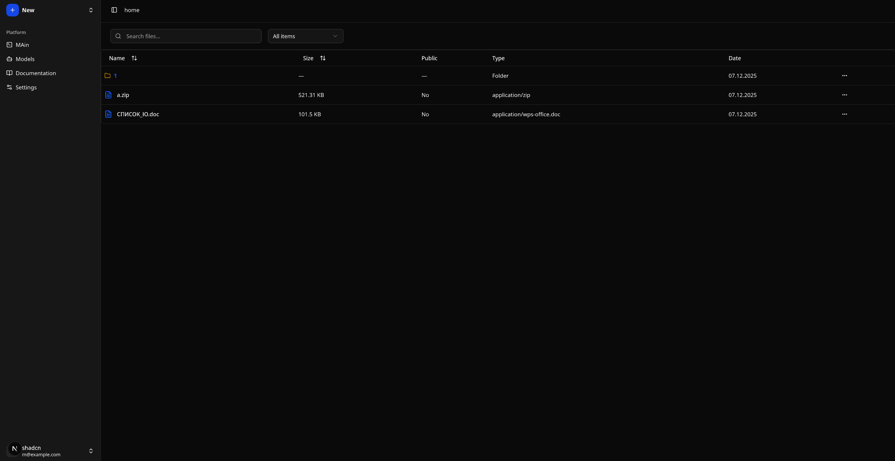
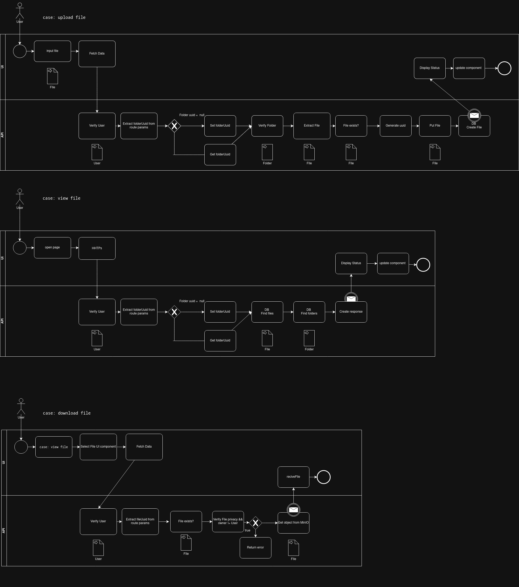
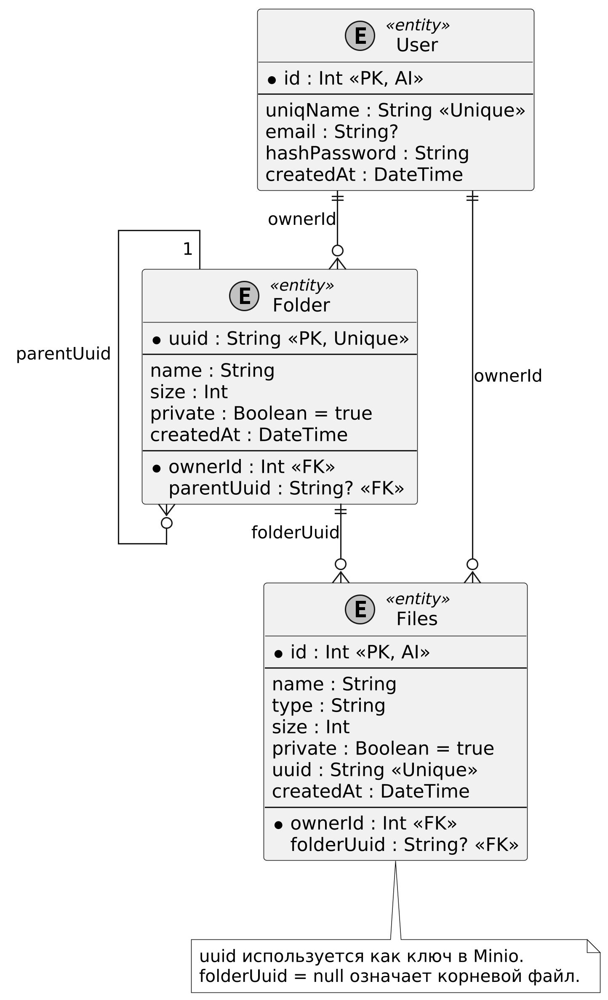
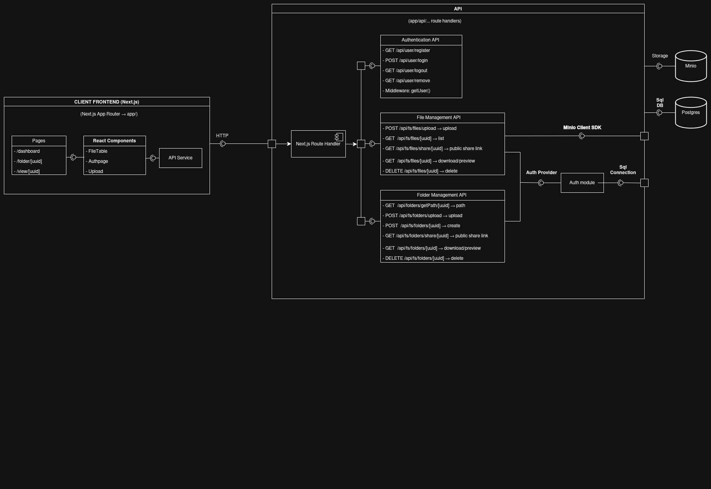

# FileHosting-site

Educational project: a simple **file hosting** service built with **Next.js**.
The goal is to create a web application that allows users to upload, store, and download files directly through a browser.

---

## 📸 Screenshot


_Example of the user interface._

---

## ⚙️ Core Features

- 🔐 User registration and login
- 📂 File upload to the server
- 🔗 Unique link generation for file sharing
- 📑 User’s file list
- ❌ File deletion
- And more...

---

## 📊 Diagrams

- **Use Case Diagram**
  

- **ER Diagram**
  

- **Software Component Diagram**
  

---

## 🛠️ Tech Stack

- **Framework**: Next.js
- **Language**: TypeScript
- **Database**: PostgreSQL
- **Object Storage**: MinIO (S3-compatible)
- **Testing**: Vitest + Testcontainers

---

## 🚀 Installation & Usage

```bash
# Install dependencies
npm install

# Run in development mode
npm run dev

# Build for production
npm run build
npm start
```
